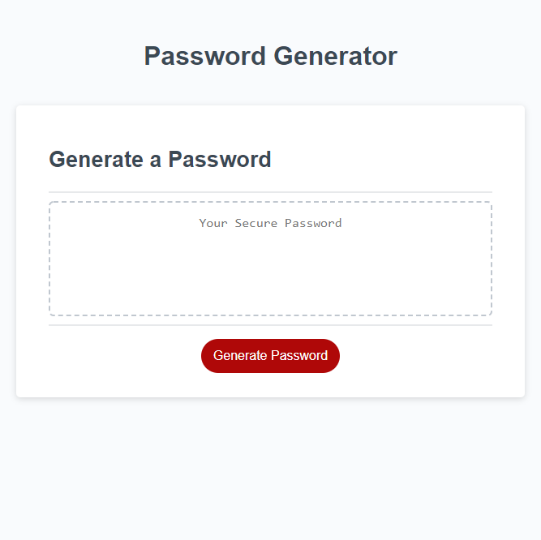

# Password Generator Starter Code

# Objective

- Create a password generator that meets the following criteria in order to create strong passwords for better security.
    - Generator should prompt the user to select which criterias need to be included in the password.
    - Password length should be a minimum of 8 characters and no more than 128 characters.
    - List of criterias prompted should include lowercase, uppercase, numeric, and/or special characters.
    - Generated password should meet all criterias selected.
    - Password should be displayed as an alert or wirtten on page.

# Technologies Used

- HTML5
- CSS3
- Javascript

# Contributors

- Initial files and starter codes from Xandromus
    - github info = https://github.com/coding-boot-camp/friendly-parakeet/commits?author=Xandromus

# URLS

- Github Repository = https://github.com/maiyiax/password-generator
- Deployed Site = https://maiyiax.github.io/password-generator/
